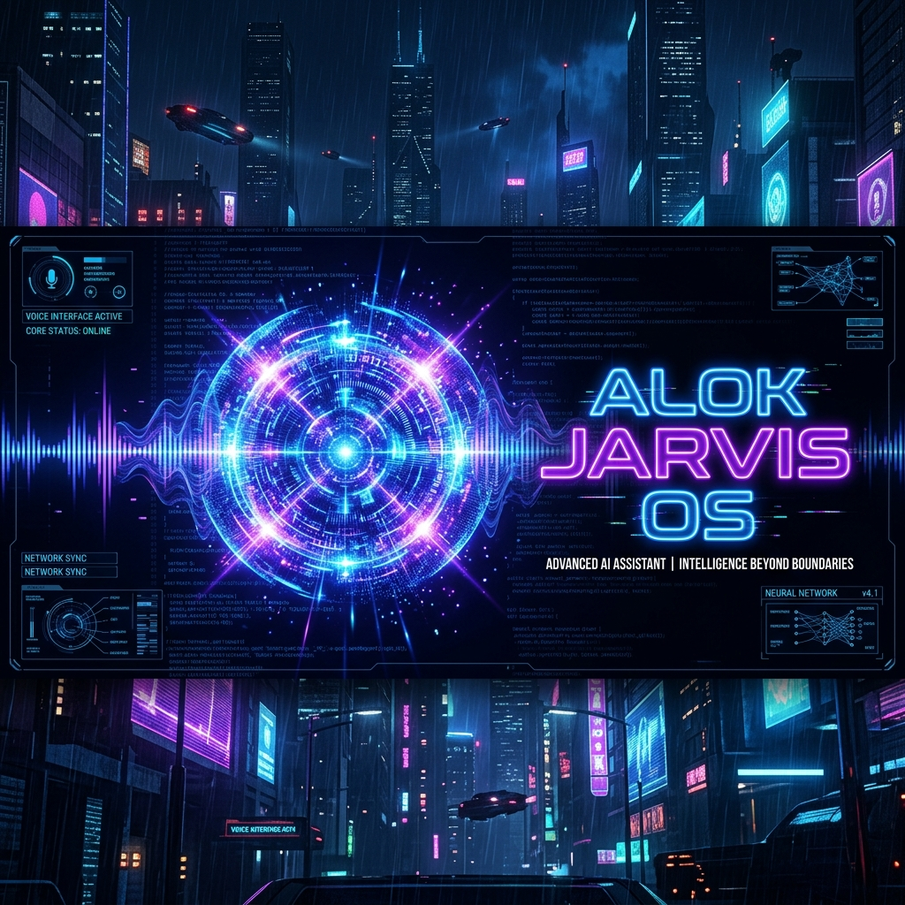
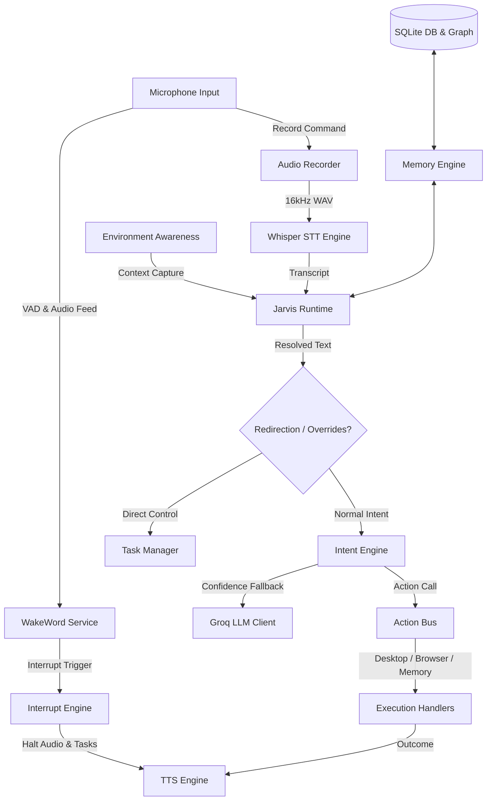

<div align="center">

# 🎙️ ALOK Jarvis OS 🤖

**The Ultra-Fast, 100% Local, Real-Time AI Voice Assistant & Desktop Automation OS**

[](https://github.com/alokkumar2510/alok_jarvis_os/stargazers)
[](https://www.rust-lang.org/)
[](https://tauri.app/)
[](LICENSE)
[](https://github.com/alokkumar2510/alok_jarvis_os)

---



*Unleash a futuristic, neon-cyberpunk desktop interface controlled entirely by your voice, running entirely offline with sub-50ms interrupt latencies.*

</div>

---

## 🔥 Key Viral Features
*   ⚡ **Sub-50ms Speech Interrupt & Preemption:** Say goodbye to waiting for the assistant to finish talking. When you speak the wake-word mid-sentence, ALOK immediately stops, rolls back tasks, and starts listening.
*   🔒 **100% Local & Privacy-First:** Run local Voice Activity Detection (VAD), Whisper STT, and Piper TTS without sending any of your keystrokes, voice, or files to external servers.
*   🧠 **SQLite Memory Graph Graph-RAG:** An autonomous brain that consolidates, merges, and decays semantic relationships in a local database—allowing Jarvis to recall details like "Who Neha is" or your coffee preferences weeks later.
*   ⚙️ **Swarm Agent Control & Task Rollback:** Transaction-safe execution. If ALOK fails a file modification midway, she executes registered rollbacks to restore your files automatically.
*   💻 **Developer Workspace Awareness:** Detects syntax or compiler errors from your active editor (VS Code) and automatically suggests offline code diagnostics.

---

## 🌐 Live Deployments
*   **Official Website:** [jarvis.alokkumarsahu.in](https://jarvis.alokkumarsahu.in) (Landing page and distribution site, hosted on Cloudflare Pages).
*   **Auto-Updater Endpoint:** `https://jarvis.alokkumarsahu.in/update.json` (Manifest endpoint used by the Tauri desktop client for checking and receiving updates).

---

## 📥 Download & User Guide

For users who want to run **ALOK Jarvis OS** without building it from source, follow the instructions below to download and install the pre-compiled desktop application:

### 1. Download the Installer
*   **Windows Setup (.exe):** Download [v0.1.0 Setup Installer (x64)](https://github.com/alokkumar2510/alok_jarvis_os/releases/download/v0.1.0/alok_jarvis_os_0.1.0_x64-setup.exe) — *Recommended for standard Windows setup*.
*   **Windows Bundle (.msi):** Download [v0.1.0 MSI Bundle (x64)](https://github.com/alokkumar2510/alok_jarvis_os/releases/download/v0.1.0/alok_jarvis_os_0.1.0_x64_en-US.msi) — *Ideal for enterprise or custom group policy distribution*.
*   **Latest Releases:** Access all stable releases on the [GitHub Releases](https://github.com/alokkumar2510/alok_jarvis_os/releases) page.
*   **SHA-256 Checksum (v0.1.0):** `b07ea0b1b4115a38e1a7b07debf581f0b77d999925f8acb8f39d322b0ba0a822`

### 2. Installation Steps
1. Run the downloaded installer (`alok_jarvis_os_0.1.0_x64-setup.exe`).
2. Follow the setup wizard to complete the installation.
3. Launch **ALOK Jarvis OS** from your desktop or start menu.

### 3. Voice Engines & Local Setup
*   **Automatic Downloader (Recommended):** On first boot, the application checks for the local voice models. If missing, it will display a setup screen and automatically download and extract Whisper (STT) and Piper (TTS) models directly from Hugging Face. Ensure you have an active internet connection during this initial setup.
*   **Manual Setup (Optional):**
    *   **Whisper STT:** Place `whisper-cli.exe` and `ggml-base.bin` in `e:\ALOK PC\bin\` and `e:\ALOK PC\models\`.
    *   **Piper TTS:** Place `piper.exe` and voice files inside `e:\ALOK PC\bin\piper\` and `e:\ALOK PC\models\piper\`.

### 🖥️ System Requirements
*   **OS:** Windows 10 / 11 (64-bit).
*   **Internet:** Needed only for the first boot download sequence (approximately 150MB). Subsequent operations run 100% offline.

---

## 🏛️ System Architecture



---

## 🛠️ Codebase Structure

```
alok_jarvis_os/
├── package.json                   # NPM configurations
├── src/                           # Visual Webview UI (Vanilla HTML/CSS/JS)
│   ├── index.html                 # Core Overlay structure
│   ├── command_center.html        # Interactive Command Center HUD
│   ├── styles.css                 # Cyberpunk Neon Visual Theme
│   ├── main.js                    # Webview animation controllers
│   └── assets/
│       └── banner.png             # UI Asset
└── src-tauri/                     # Tauri backend (Rust)
    ├── Cargo.toml                 # Rust dependencies
    ├── tauri.conf.json            # Tauri runtime configurations
    └── src/
        ├── main.rs                # Tauri App Entry Point
        ├── lib.rs                 # Intent Router & Command Coordinator
        ├── action_bus.rs          # Action Bus Execution Pipeline
        ├── command_arbitrator.rs  # Command Arbitration
        ├── consciousness/         # self, user, timeline, world states
        ├── control/               # Interrupts, task managers, rollbacks
        ├── database/              # SQLite DB interface & graph seeding
        ├── environment_awareness/ # Clipboard, active editor, active tab
        ├── intelligence/          # Groq, Memory consolidator, Developer
        └── voice/                 # VAD, Recorder, Whisper, Piper TTS
```

---

## 💻 Developer Setup: Build from Source

### 📋 Prerequisites
1. **Rust & Cargo:** Install via [rustup.rs](https://rustup.rs/).
2. **Node.js & NPM:** Install via [nodejs.org](https://nodejs.org/).
3. **Whisper CLI:** Place `whisper-cli.exe` and `ggml-base.bin` inside `e:\ALOK PC\bin\` and `e:\ALOK PC\models\`.
4. **Piper TTS:** Place `piper.exe` and voice files inside `e:\ALOK PC\bin\piper\` and `e:\ALOK PC\models\piper\`.

### ⚙️ Installation
```bash
# Clone the repository
git clone https://github.com/alokkumar2510/alok_jarvis_os.git
cd alok_jarvis_os

# Install dependencies
npm install

# Set Groq API Key env var (Optional fallback)
set GROQ_API_KEY=your_key_here

# Launch Tauri Development Server
npm run tauri dev
```

---

## 🧪 Integration Testing
Run conversational and execution tests offline:
```bash
cargo run --bin test_advanced_conversational
```

---

## 🏷️ Search Engine Optimization (SEO) & Tags
To maximize visibility across GitHub search, social feeds, and search engines, the following keywords and tags are indexed:
*   `rust-voice-assistant` `offline-jarvis` `tauri-voice-ai` `local-ai-agent` `piper-tts-rust` `whisper-stt-offline` `cyberpunk-hud` `task-automation` `sqlite-memory-graph` `real-time-interrupt-speech` `privacy-focused-assistant` `desktop-automation-rust` `autonomous-agents` `tauri-os`

---

## 📜 License
Licensed under the MIT License. Developed for the next generation of privacy-first, ultra-responsive smart operating systems.
