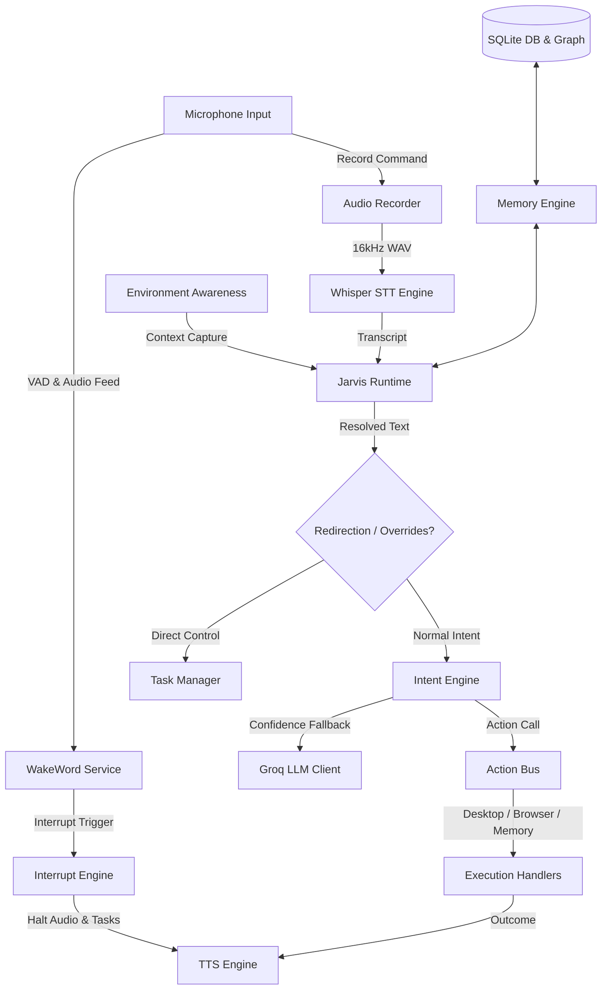

# ALOK Jarvis OS 🎙️🤖

ALOK Jarvis OS is a localized, real-time voice assistant and desktop automation platform built with **Tauri**, **Rust**, and **Vanilla HTML/CSS/JavaScript**. It features local wake-word voice activity detection (VAD), Whisper-based Speech-to-Text (STT), Piper-based Text-to-Speech (TTS), long-term SQLite graph memory, developer workspace awareness, and a highly responsive interrupt & control system.

---

## 🏛️ System Architecture



---

## 🌟 Core Modules & Features

### 1. Real-Time Interrupt & Control System (`src-tauri/src/control/`)
* **Priority Manager (`priority_manager.rs`):** Enforces a strict five-tier priority queue:
  * `P0`: Emergency interrupts
  * `P1`: Voice commands
  * `P2`: Swarm agent tasks
  * `P3`: Background monitors
  * `P4`: Learning & analytics
* **Task Manager (`task_manager.rs`):** Tracks and logs active task lifecycles with thread-safe `tokio::sync::watch` channels for instant pause/resume yielding.
* **Safe Transactional Operations (`task_cancellation.rs`):** Performs file modifications with a temporary sandbox fallback, allowing automated tasks to cleanly rollback all changes (copies, moves, deletes) if cancelled or aborted.
* **Interrupt Engine (`interrupt_engine.rs`):** Instantly terminates speaker output via Win32 `SND_PURGE`, handles speech-to-listening UI transitions, and triggers goal redirection on wake-word detection.

### 2. Voice & Speech Engine (`src-tauri/src/voice/`)
* **Wakeword (`wakeword.rs`):** Background audio capture using `CPAL` that calculates RMS audio levels for lightweight, local VAD triggering.
* **Whisper STT (`whisper.rs`):** Local execution of `whisper-cli.exe` with support for base/tiny ONNX models to transcribe commands offline.
* **TTS System (`tts.rs`):** Local Piper voice synthesis with Windows native SpeechSynthesizer fallback. Plays memory-buffered WAV chunks asynchronously to guarantee FFI memory safety and avoid blocking the worker thread.
* **Personality & Emotion Engine (`emotion_engine.rs` / `speech_style_engine.rs`):** Adapts speech parameters (speed, energy, pause multipliers, warmth) dynamically based on user emotional states (Happy, Excited, Sad, Confused, Focused, Stressed) and selected personality profiles (Companion, Developer, Professional, Friendly, Assistant).
* **Presence Signatures (`presence_system.rs`):** Audio indicators (chimes/signatures) to communicate when the assistant is idling, listening, or speaking.

### 3. Intelligence, LLM, & Graph Memory (`src-tauri/src/intelligence/`)
* **Groq Client (`groq.rs`):** Connects to cloud models (e.g. `llama-3.1-8b-instant`) using native OS `curl.exe` to query responses without bulky HTTP dependencies.
* **Memory Engine (`memory_engine.rs`):** Implements an autonomous graph database in SQLite (`nodes` and `edges`) to store relationship memories, execute semantic de-duplication, and decay inactive memories over time.
* **Developer Engine (`developer_engine.rs` / `log_analyzer.rs`):** Integrates workspace diagnostics, enabling automated detection of compiler/runtime errors (Rust, Python, Node, Flutter) and suggesting local fixes.
* **Health Monitor (`health_monitor.rs`):** Collects telemetry on system RAM, CPU load, and response latencies to trigger diagnostics or self-optimizations.

### 4. Desktop Automation & Action Bus (`src-tauri/src/desktop/` / `src-tauri/src/action_bus.rs`)
* **Keystroke / Process Control (`control.rs`):** Natively launches apps, kills processes, sends system keystrokes, and automates UI steps.
* **Browser Integration (`automation_runtime.rs`):** Scans browser tabs, parses DOM labels using UI automation, and runs scripts.

---

## 📂 Project Directory Structure

```
alok_jarvis_os/
├── package.json                   # NPM script configurations
├── src/                           # Frontend HTML/CSS/JS files
│   ├── index.html                 # Core overlay structure
│   ├── command_center.html        # Interactive Command Center HUD
│   ├── styles.css                 # Dark-mode styled visual engine
│   └── main.js                    # Webview event listeners & animations
└── src-tauri/                     # Tauri backend (Rust)
    ├── Cargo.toml                 # Rust dependencies
    ├── tauri.conf.json            # Tauri runtime configuration
    └── src/
        ├── main.rs                # Tauri App Entry Point
        ├── lib.rs                 # Intent Router & Command Coordinator
        ├── action_bus.rs          # Action Bus Execution Pipeline
        ├── command_arbitrator.rs  # Prevents race conditions on keys
        ├── consciousness/         # self, user, timeline, world states
        ├── control/               # Interrupts, task managers, rollbacks
        ├── database/              # SQLite DB interface & graph seeding
        ├── desktop/               # Process launch, closing, active window
        ├── environment_awareness/ # Clipboard, active editor, active tab
        ├── intelligence/          # Groq, Memory consolidator, Developer
        └── voice/                 # VAD, Recorder, Whisper, Piper TTS
```

---

## 🛠️ Requirements & Setup

### Prerequisites
1. **Rust & Cargo:** Install via [rustup.rs](https://rustup.rs/).
2. **Node.js & NPM:** Install via [nodejs.org](https://nodejs.org/).
3. **C++ Build Tools:** Visual Studio Build Tools for Windows compiling.
4. **Whisper CLI:** Place `whisper-cli.exe` and model file `ggml-base.bin` inside `e:\ALOK PC\bin\` and `e:\ALOK PC\models\` respectively.
5. **Piper TTS:** Place `piper.exe` and voice files (`en_US-lessac-medium.onnx`, `en_US-lessac-medium.onnx.json`) inside `e:\ALOK PC\bin\piper\` and `e:\ALOK PC\models\piper\` respectively.

### Installation
1. Clone the repository and navigate to the project directory:
   ```bash
   git clone https://github.com/alokkumar2510/alok_jarvis_os.git
   cd alok_jarvis_os
   ```
2. Install npm dependencies:
   ```bash
   npm install
   ```

---

## 🚀 Running the Project

### Environment Variables
Configure your `GROQ_API_KEY` in your Windows Environment Variables or in a `.env` file at the project root:
```env
GROQ_API_KEY=your_groq_api_key_here
```

### Start Development Server
```bash
npm run tauri dev
```

---

## 🧪 Integration Testing

Run the conversational and execution tests offline:
```bash
# Compile and run conversational intelligence integration tests
cargo run --bin test_advanced_conversational
```

---

## 📜 License
This project is licensed under the MIT License.
